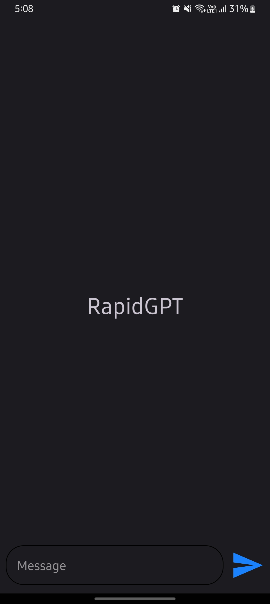
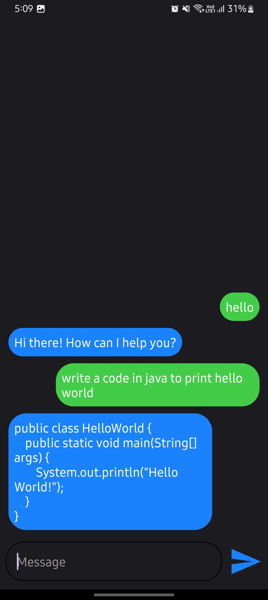
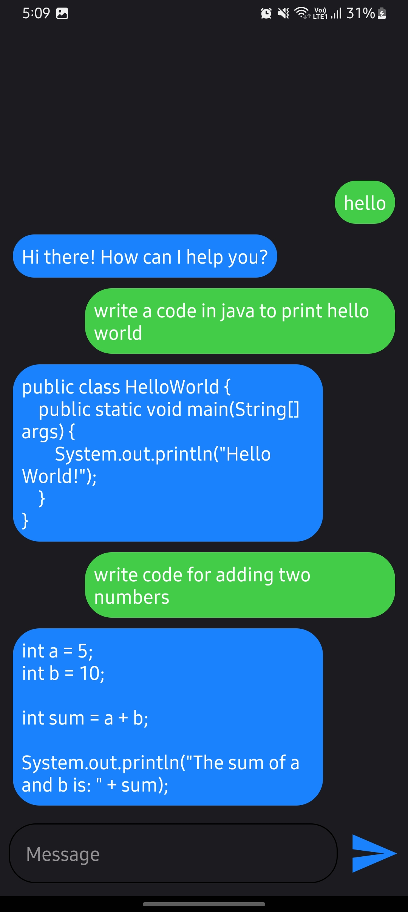
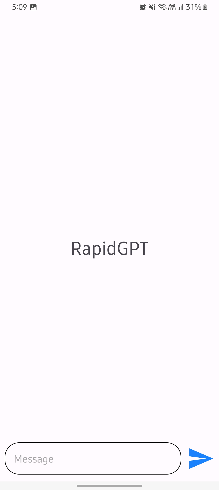
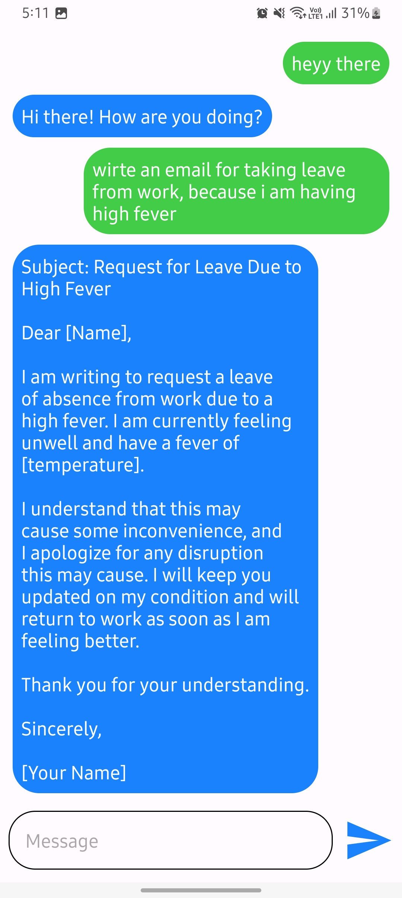

  <h1 align="center">RapidGPT</h1>

## About This App:
RapidAPI is an innovative chatbot app developed using Java and Android Studio. Powered by the OpenAI GPT API, it intelligently processes user input and generates meaningful responses. This interactive application leverages cutting-edge technology to facilitate dynamic conversations, enhancing user engagement and experience.

## Screen Shots:

  
  
  
  
  

### Steps to Run on Local Machine

***

#### Note: You need to have Android Studio installed in your Local Machine if not, first install it from <a href="https://developer.android.com/studio">here</a>.
##### Step 1) Clone jontybhalodiya/RapidGPT.
##### Step 2) Open MainActivity.java and paste your OpenAI API KEY at the Place of /* INSERT YOUR CHATGPT API KEY HERE*/ on line 108.

***
